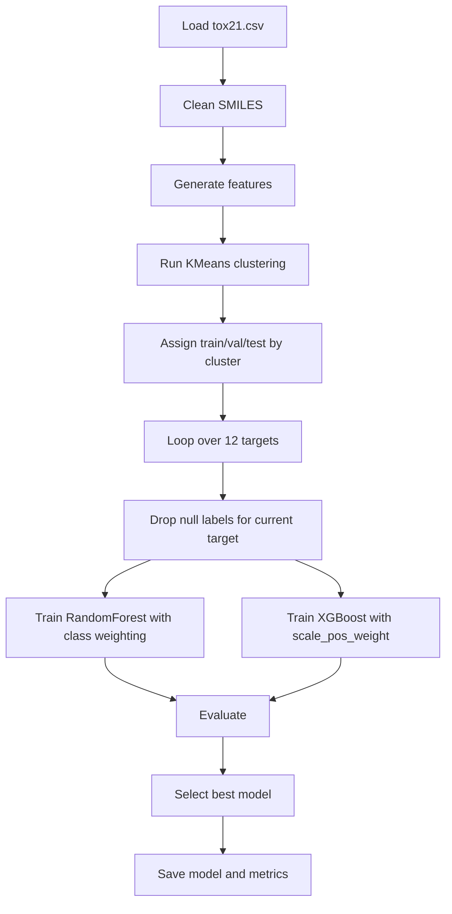

# Implementation Details

## Modeling Stack

We will use a staged modeling approach.

### Model 1: Baseline

- `RandomForestClassifier`

Purpose:

- fast baseline
- robust on mixed descriptor and fingerprint features
- easy feature importance
- low tuning overhead

### Model 2: Main model

- `XGBClassifier`

Purpose:

- stronger predictive performance than the baseline in many tabular settings
- handles nonlinear feature interactions well
- good fit for descriptor + fingerprint feature spaces
- can use GPU in Google Colab

### Optional Model 3

- `LogisticRegression`

Purpose:

- sanity-check baseline
- simple calibration reference

## Final Modeling Rule

For each toxicity endpoint in Tox21:

1. train a `RandomForestClassifier`
2. train an `XGBClassifier`
3. compare validation metrics
4. keep the better-performing model for that target

This means the final system may use a mixture of models across endpoints.

## Class Imbalance Strategy

The dataset is heavily imbalanced across all assays, so imbalance handling is mandatory.

Primary approach:

- `class_weight="balanced"` for `RandomForestClassifier`
- `scale_pos_weight` for `XGBClassifier`

Optional approach:

- SMOTE on the training split only

Rule:

- do not apply SMOTE before the split
- do not apply SMOTE to validation or test data

## Targets

The local Tox21 file contains 12 binary toxicity targets:

- `NR-AR`
- `NR-AR-LBD`
- `NR-AhR`
- `NR-Aromatase`
- `NR-ER`
- `NR-ER-LBD`
- `NR-PPAR-gamma`
- `SR-ARE`
- `SR-ATAD5`
- `SR-HSE`
- `SR-MMP`
- `SR-p53`

Each target will be trained separately.

## Feature Inputs

The model input will be a concatenation of:

- Morgan fingerprints
- RDKit descriptors
- physicochemical properties

### Core descriptors

- molecular weight
- `MolLogP`
- TPSA
- H-bond donors
- H-bond acceptors
- rotatable bonds
- ring count
- aromatic ring count
- fraction Csp3

### Fingerprint settings

- Morgan fingerprint
- radius `2`
- `1024` or `2048` bits

## Train / Validation / Test Strategy

We will not use a naive random split as the main split.

Instead, we will use a **KMeans cluster-based split** on molecular feature space.

This is likely what you were aiming at by "k means theorem". It is not really a theorem here; it is a clustering-based data splitting strategy.

## Why KMeans-based splitting

In molecular ML, random splitting can leak very similar compounds into both train and test sets. That makes performance look better than real-world generalization.

Using KMeans clustering gives a more realistic split:

- chemically similar molecules tend to fall into nearby groups
- whole clusters can be allocated across train/validation/test
- evaluation becomes more honest

## Split Procedure

### Step 1: Build unsupervised feature representation

Use either:

- Morgan fingerprints only, or
- fingerprints + a few normalized descriptors

Recommended for clustering:

- Morgan fingerprint + standardized descriptor subset

### Step 2: Run KMeans

Apply `KMeans` to all valid Tox21 molecules.

Recommended:

- `n_clusters = 20` to start

This can be adjusted based on dataset size and cluster balance.

### Step 3: Split by clusters, not rows

Assign full clusters into:

- `70%` training
- `15%` validation
- `15%` test

Important:

- rows from the same cluster should stay in the same split
- do not split cluster members across train and test

## Per-Target Label Handling

Tox21 has missing labels.

For each target:

1. start from the global split assignment
2. drop only rows where that target label is missing
3. train and evaluate on the remaining rows inside that split

This preserves a consistent train/validation/test policy while respecting target sparsity.

## Training Flow

## Evaluation Metrics

For every target, record:

- ROC-AUC
- PR-AUC
- F1
- precision
- recall
- positive class rate
- number of training / validation / test samples

## Model Selection Rule

Pick the final model for each target using:

1. highest validation ROC-AUC
2. if close, compare PR-AUC
3. if still close, prefer the simpler model

## How the Trained Models Will Be Used

### In Streamlit prediction

1. user enters a SMILES string
2. molecule is validated
3. the exact same feature pipeline is applied
4. all 12 saved models are loaded
5. probability is predicted for each endpoint
6. an aggregate toxicity score is computed
7. the result is shown in the UI

### In ZINC screening

1. clean the ZINC SMILES column
2. generate the same features
3. run all saved endpoint models
4. compute average toxicity risk
5. combine with `qed`, `SAS`, and `logP`
6. rank candidate molecules

## Aggregate Risk Score

For the first version:

- overall toxicity score = mean of 12 endpoint probabilities

Optional later:

- weighted mean if certain endpoints are considered more important

## Practical Notes

- `RandomForest` is already available through `scikit-learn`
- `XGBoost` must be installed separately via `xgboost`
- SMOTE is provided by `imbalanced-learn`
- if `XGBoost` causes setup issues, we can fall back to `HistGradientBoostingClassifier` from scikit-learn
- first training workflow will be notebook-based and Colab-friendly
- GPU is useful for `XGBoost`, but not required for `RandomForest`

## Final Decision Summary

- split strategy: KMeans cluster-based split
- baseline model: RandomForest
- main model: XGBoost
- imbalance handling: class weighting first, SMOTE optional
- training style: one classifier per endpoint
- training environment: Jupyter notebook in Google Colab
- app: Streamlit with local/server-side inference
- screening: precomputed batch scoring on ZINC
