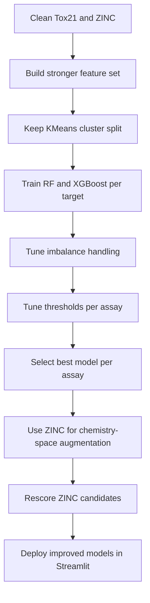

# Model Improvement Strategy

## Objective

Improve toxicity prediction quality without deviating from the existing project plan:

- keep `tox21.csv` as the only supervised toxicity label source
- keep `250k_rndm_zinc_drugs_clean_3.csv` as the secondary dataset
- keep per-target binary classifiers
- keep `RandomForestClassifier` and `XGBClassifier` as the main model families
- keep the KMeans cluster-based split
- keep Streamlit as the final demo interface

This strategy is about making the current system more accurate, more stable, and more presentation-ready.

---

## 1. What Is Currently Limiting Accuracy

From the current results pattern:

- several assays have good `ROC-AUC` but weak `F1`
- some assays are under-calling the toxic class
- model performance varies a lot by endpoint

That usually means the current bottlenecks are:

1. heavy class imbalance
2. threshold choice fixed at `0.5`
3. limited feature richness
4. per-assay hyperparameters not tuned enough
5. underuse of the ZINC dataset as a chemistry-space support set

So the next improvement pass should not be a full redesign. It should be a controlled upgrade of the current pipeline.

---

## 2. Non-Negotiable Rules

To stay aligned with the root planning files:

- do not switch to a GNN for the main version
- do not replace the per-target modeling strategy
- do not use ZINC as if it had toxicity labels
- do not evaluate on a random split instead of the KMeans cluster split
- do not build the app before the improved training pipeline is stable

---

## 3. High-Level Improvement Plan

---

## 4. How We Will Use Both Datasets

## Dataset roles

### Tox21

Use for:

- supervised training
- validation
- test evaluation
- per-assay threshold selection

### ZINC250k

Use for:

- descriptor enrichment
- chemistry-space coverage
- unlabeled feature support
- candidate screening
- confidence and out-of-distribution checks

Important rule:

ZINC improves the system by improving feature context and screening value, not by pretending to provide toxicity labels.

---

## 5. Strategy For Using ZINC Without Breaking the Project Scope

## A. Add ZINC physicochemical features into the shared feature logic

For Tox21 and ZINC alike, compute the same core descriptor set:

- molecular weight
- `MolLogP`
- TPSA
- H-bond donors
- H-bond acceptors
- rotatable bonds
- ring count
- aromatic ring count
- fraction Csp3
- QED
- SAS

Why this helps:

- ZINC already contains `logP`, `qed`, and `SAS`
- those features are chemically meaningful
- they help the model move beyond pure fingerprint bits

For Tox21:

- compute `QED` and `SAS` from RDKit if possible
- if `SAS` is too expensive to implement immediately, keep it as a second-pass enhancement

## B. Build combined chemistry-space clusters from Tox21 + ZINC

Instead of clustering only Tox21 for chemistry-space analysis, fit the clustering basis on a combined feature space from:

- all valid Tox21 molecules
- a sampled subset of ZINC molecules

Then:

- assign each Tox21 molecule to a broader chemical-space cluster
- use cluster identity or distance-to-centroid as extra features

Why this helps:

- Tox21 is relatively small
- ZINC provides a much larger map of drug-like molecular space
- this gives the model more context about where each Tox21 compound sits in chemistry space

Use carefully:

- keep the official train/val/test split based on Tox21 indices only
- do not leak labels through combined data

## C. Add neighborhood features from ZINC

For each Tox21 molecule, compute nearest-neighbor summary features from ZINC in fingerprint space.

Possible neighbor-derived features:

- mean neighbor `logP`
- mean neighbor `qed`
- mean neighbor `SAS`
- similarity to closest ZINC molecules
- local density in drug-like space

Why this helps:

- it gives contextual information beyond the single molecule
- it may help the model identify if a compound lives in a dense, drug-like region or a rarer chemistry region

This stays within the project rules because:

- the neighbor features come from unlabeled chemistry descriptors
- no fake toxicity labels are introduced

## D. Use ZINC for confidence scoring

For app predictions, estimate how "in-distribution" a user molecule is by comparing it to the combined Tox21/ZINC chemistry space.

App output can include:

- prediction score
- confidence indicator
- note if the molecule is far from the training chemistry space

Why this helps:

- not directly a training accuracy change
- but it improves reliability and presentation quality
- it prevents overconfident predictions on outlier molecules

## E. Optional last-step pseudo-labeling

Only if the baseline pipeline is already stable:

1. score ZINC with the trained per-assay models
2. select only very high-confidence pseudo-labels
3. retrain a small comparison model
4. keep it only if it improves validation metrics consistently

Rules:

- treat this as experimental only
- never replace the supervised Tox21 core
- only keep if validation results improve

This is the only part of the strategy that is higher-risk, so it should be a stretch experiment, not the default plan.

---

## 6. Core Accuracy Improvements Inside Tox21 Training

## A. Improve feature engineering

Current base:

- Morgan fingerprints
- core RDKit descriptors

Improvement pass:

- add `QED`
- add `SAS`
- add `NumValenceElectrons`
- add `HeavyAtomCount`
- add `NHOHCount`
- add `NOCount`
- add `NumAliphaticRings`
- add `NumAromaticHeterocycles`
- add `NumSaturatedRings`

Feature policy:

- keep the feature pipeline shared across training, screening, and Streamlit inference
- do not let notebook-only features drift from app features

## B. Tune imbalance handling per assay

Current rule:

- class weighting first

Improvement pass:

1. keep `class_weight="balanced"` for RandomForest
2. compute `scale_pos_weight` separately for each assay in XGBoost
3. test SMOTE only on the training split
4. compare:
   - weighted training only
   - weighted training + SMOTE

Expected effect:

- higher recall on rare toxic classes
- better PR-AUC on weaker assays

## C. Tune thresholds per assay

This is likely the fastest accuracy gain for the current model family.

Right now, several assays appear to rank well but predict too few positives at threshold `0.5`.

Improvement pass:

- use validation predictions
- choose threshold per target based on:
  - best F1, or
  - best recall subject to minimum precision

Recommended practical rule:

- for screening use cases, prefer higher recall over raw accuracy

This should improve:

- F1
- recall
- toxic-compound detection

without changing the underlying model.

## D. Tune XGBoost properly

The current XGBoost settings are a starting point only.

Tune these parameters per target with a small search:

- `max_depth`
- `min_child_weight`
- `learning_rate`
- `n_estimators`
- `subsample`
- `colsample_bytree`
- `reg_alpha`
- `reg_lambda`

Search style:

- small grid or random search
- use validation ROC-AUC and PR-AUC
- stop after a compact search, not an exhaustive sweep

## E. Use model ensembling only if it clearly helps

Primary rule:

- select the best single model per target

Optional improvement:

- average the RF and XGBoost predicted probabilities for hard assays

Keep this only if:

- validation PR-AUC improves
- calibration improves

Do not ensemble by default on every target.

---

## 7. Better Evaluation Strategy

To improve the model, we need to inspect the right failure modes.

For each assay, produce:

- validation ROC-AUC
- validation PR-AUC
- test ROC-AUC
- test PR-AUC
- tuned threshold
- test precision
- test recall
- confusion matrix

Interpretation rule:

- for imbalanced assays, PR-AUC and recall matter more than raw accuracy

Also add:

- prediction histogram for toxic vs non-toxic
- probability calibration plot
- top false positives and false negatives analysis

These are useful because they tell us whether the problem is:

- poor ranking
- poor threshold
- poor calibration
- weak features

---

## 8. Proposed Experiment Ladder

Run experiments in this order.

### Experiment 1: Threshold tuning only

Change:

- keep current models
- tune threshold per assay on validation set

Goal:

- improve F1 and recall immediately

### Experiment 2: Stronger descriptors

Change:

- add `QED`, `SAS`, and extra RDKit descriptors

Goal:

- improve PR-AUC and interpretability

### Experiment 3: Better XGBoost tuning

Change:

- tune class weighting and booster hyperparameters

Goal:

- improve ranking quality on weaker assays

### Experiment 4: SMOTE comparison

Change:

- compare no-SMOTE vs SMOTE on training only

Goal:

- see whether minority-class recall improves without harming calibration

### Experiment 5: ZINC chemistry-space features

Change:

- add combined-space cluster and neighbor features derived from ZINC

Goal:

- improve feature richness and generalization context

### Experiment 6: Selective ensemble

Change:

- blend RF and XGBoost on assays where both have complementary behavior

Goal:

- improve borderline endpoints only

Do not skip directly to Experiment 5 or 6. The earlier experiments are lower risk and more aligned with the existing build plan.

---

## 9. What Success Should Look Like

Success does not mean every assay becomes strong.

A realistic success target is:

- more assays with usable recall
- higher PR-AUC on weak endpoints
- fewer endpoints with `F1` near zero
- stronger consistency across all 12 targets
- better top-candidate ranking on ZINC screening

In practice, we want:

- threshold-tuned models for all 12 assays
- a better average PR-AUC than the current run
- a shortlist of ZINC candidates with low predicted toxicity and strong `qed` / `SAS`

---

## 10. How This Fits the Streamlit App

The improved training strategy feeds directly into the planned app.

### Predict page

Show:

- 12 assay probabilities
- overall toxicity score
- threshold-aware risk category
- confidence / chemistry-space warning

### Insights page

Show:

- per-assay ROC-AUC and PR-AUC
- class imbalance chart
- feature importance plots
- threshold summary

### Candidate Explorer

Show:

- top-ranked ZINC candidates
- `qed`, `SAS`, `logP`
- predicted toxicity summary

---

## 11. Final Recommended Strategy

The best improvement path, while staying inside the current project plan, is:

1. keep Tox21 as the only supervised label source
2. keep RF and XGBoost as the main models
3. improve the feature set with more chemistry descriptors
4. tune class imbalance handling per assay
5. tune thresholds per assay using validation data
6. use ZINC to add chemistry-space context and screening value
7. only try pseudo-labeling or ensembling after the core pipeline is stable

This gives the project the highest chance of improving real toxicity prediction quality without breaking the existing architecture, claims, or hackathon timeline.
