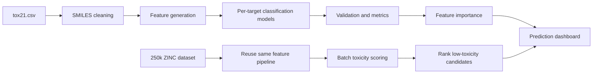
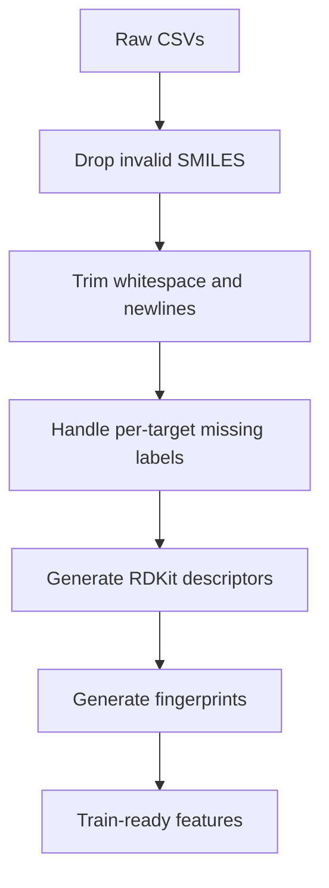

# CodeCure Track A: Drug Toxicity Prediction

## 24-Hour Execution README

This repository is for **Problem Statement 1** from the CodeCure AI Hackathon PDF:

> Build a machine learning model that predicts potential drug toxicity using chemical structure and molecular descriptor data, and interpret which molecular properties contribute most strongly to toxicity risk.

## Streamlit App

The project now includes a Streamlit app at `streamlit_app/app.py`.

Run it with:

```bash
streamlit run streamlit_app/app.py
```

What it does:

- trains the toxicity pipeline inside the Streamlit process on first use
- reproduces the improved notebook leaderboard table
- predicts toxicity from user-provided SMILES
- screens a configurable ZINC sample for low-toxicity candidates

For a **1-day hackathon**, the correct strategy is not to overbuild. The fastest path is:

1. Use `tox21.csv` as the supervised training dataset.
2. Use `250k_rndm_zinc_drugs_clean_3.csv` as the screening and feature-enrichment dataset.
3. Build a strong, interpretable baseline first.
4. Add one clear demo flow: **input SMILES -> predict toxicity -> explain why -> show safer candidate examples**.

---

## 1. What We Have

### Local files

| File | Role | What it contains |
|---|---|---|
| `tox21.csv` | Primary supervised dataset | Multi-label toxicity assay targets + `smiles` |
| `250k_rndm_zinc_drugs_clean_3.csv` | Secondary dataset | Large unlabeled screening set with `smiles`, `logP`, `qed`, `SAS` |
| `CodeCure Biohackathon Problem Statement (1).pdf` | Problem statement | Official hackathon brief |

### Quick dataset reality check

| Dataset | Rows | Key columns |
|---|---:|---|
| `tox21.csv` | 7,831 | 12 toxicity targets, `mol_id`, `smiles` |
| `250k_rndm_zinc_drugs_clean_3.csv` | 249,455 | `smiles`, `logP`, `qed`, `SAS` |

### Tox21 targets in the local file

- `NR-AR`
- `NR-AR-LBD`
- `NR-AhR`
- `NR-Aromatase`
- `NR-ER`
- `NR-ER-LBD`
- `NR-PPAR-gamma`
- `SR-ARE`
- `SR-ATAD5`
- `SR-HSE`
- `SR-MMP`
- `SR-p53`

This is a **multi-label toxicity prediction problem** with missing values in some labels.

---

## 2. What We Should Build In 24 Hours

### Core deliverable

A compact pipeline that can:

- read SMILES
- generate molecular features
- train toxicity models
- predict toxicity probabilities for new molecules
- explain which features drive toxicity risk
- screen a large candidate pool for promising low-toxicity compounds

### Best demo narrative

The most convincing hackathon story is:

**"We trained a multi-target toxicity predictor on Tox21, interpreted the molecular drivers of toxicity, and used it to screen a large library of drug-like molecules for safer candidates."**

That story directly matches the PDF deliverables:

- toxicity model
- feature importance / interpretation
- visualizations
- optional prediction interface

---

## 3. Recommended Solution Shape



### Practical modeling choice

For a 24-hour build, use this stack:

- **SMILES + molecular descriptors + fingerprints**
- **one binary classifier per toxicity target**
- **LightGBM / XGBoost / RandomForest baseline**
- **macro summary toxicity score** across all 12 endpoints

Why this is the right tradeoff:

- faster than deep graph models
- easier to debug
- easier to explain
- performs well enough for a hackathon
- works with limited time and imperfect data
- can be trained in Colab, with GPU acceleration for XGBoost if needed

---

## 4. The 24-Hour Plan

## Phase Map

```mermaid
gantt
    title CodeCure 24-Hour Build Plan
    dateFormat  HH:mm
    axisFormat %H:%M

    section Data
    Inspect PDF and datasets        :done,    p1, 00:00, 01:00
    Clean SMILES and labels         :active,  p2, 01:00, 03:00
    Build feature pipeline          :         p3, 03:00, 06:00

    section Modeling
    Train baseline models           :         p4, 06:00, 10:00
    Evaluate and tune               :         p5, 10:00, 13:00
    Generate feature importance     :         p6, 13:00, 15:00

    section Screening
    Score ZINC candidates           :         p7, 15:00, 18:00
    Rank low-toxicity molecules     :         p8, 18:00, 19:00

    section Presentation
    Build plots and demo UI         :         p9, 19:00, 22:00
    Final README + slides + repo    :         p10, 22:00, 24:00
```



## Detailed hour-by-hour breakdown

### Hours 0-2: Problem framing and data audit

Goal:

- understand labels
- inspect missing values
- check SMILES quality
- define the exact success criteria

Tasks:

- load both CSVs
- inspect nulls per toxicity target
- remove duplicate SMILES if needed
- strip newline artifacts from ZINC SMILES
- decide modeling approach: per-target binary classifiers

Output:

- one clean training dataframe
- one clean screening dataframe
- one notebook/script for exploratory analysis

### Hours 2-6: Feature engineering

Goal:

- convert molecules into machine-learning-ready vectors

Recommended features:

- RDKit molecular descriptors
- Morgan fingerprints
- existing ZINC properties: `logP`, `qed`, `SAS`

Minimum viable feature set:

- Morgan fingerprint (radius 2, 1024 or 2048 bits)
- molecular weight
- H-bond donors
- H-bond acceptors
- TPSA
- rotatable bonds
- ring count
- `logP`

Stretch feature set:

- add `qed`
- add `SAS`
- add topological descriptors

Output:

- reusable feature generation function
- train matrix for Tox21
- batch scoring matrix for ZINC

### Hours 6-10: Baseline modeling

Goal:

- get working models for all toxicity tasks

Recommended sequence:

1. start with Logistic Regression or RandomForest as a sanity check
2. move to LightGBM / XGBoost / CatBoost if available
3. train **one model per target**

Important rule:

- ignore rows where a specific target label is missing for that target's model

Why not force a single multi-output model first:

- target sparsity differs
- missing labels complicate training
- per-target models are easier to debug and explain

Output:

- saved models for 12 endpoints
- cross-validation results
- one leaderboard table of endpoint performance

### Hours 10-13: Evaluation

Goal:

- prove the model is valid enough for the demo

Metrics to prioritize:

- ROC-AUC
- PR-AUC
- F1 at selected threshold
- positive class prevalence per target

Recommended output table:

| Target | Samples used | Positive rate | ROC-AUC | PR-AUC | F1 |
|---|---:|---:|---:|---:|---:|

Also compute:

- mean ROC-AUC across targets
- number of targets with ROC-AUC above baseline

### Hours 13-15: Interpretability

Goal:

- satisfy the PDF requirement about identifying key molecular properties

Fast interpretation methods:

- feature importance from tree models
- SHAP summary plots for top targets
- descriptor correlation plots

What to present:

- top 10 features for 3 representative toxicity targets
- fingerprint/descriptor patterns associated with higher toxicity
- simple explanation of physicochemical risk trends

Example interpretation questions:

- does high `logP` correlate with certain toxicity endpoints?
- do more aromatic/ring-heavy compounds show higher risk?
- do specific fingerprint bits repeatedly appear in toxic predictions?

### Hours 15-18: Screening the 250k ZINC set

Goal:

- turn the model into a discovery pipeline, not just a classifier

Plan:

1. apply the same feature pipeline to ZINC molecules
2. predict probability for each of the 12 endpoints
3. create an aggregate toxicity score
4. filter for drug-like candidates with favorable `qed`, `SAS`, and acceptable `logP`

Suggested ranking formula:

```text
overall_score =
    0.50 * (1 - mean_toxicity_probability)
  + 0.25 * normalized_qed
  + 0.15 * synthetic_accessibility_bonus
  + 0.10 * logP_penalty_adjustment
```

Use this only as a hackathon ranking heuristic, not as a scientific claim.

Output:

- top 20 low-toxicity candidate molecules
- table with predicted endpoint risks
- shortlist for demo screenshots

### Hours 18-22: Demo layer and visuals

Goal:

- make the project easy to understand in under 2 minutes

Best lightweight UI choices:

- Streamlit
- Gradio
- notebook dashboard if time is tight

Minimum demo features:

- text input for SMILES
- predict button
- per-target toxicity probabilities
- overall risk badge
- top contributing features

Nice extra:

- compare user-entered molecule against top screened ZINC candidates

### Hours 22-24: Submission hardening

Goal:

- convert the technical work into a strong judging package

Checklist:

- clean repository structure
- reproducible run instructions
- screenshots
- key result plots
- final README
- 1-minute pitch flow

---

## 5. Recommended Repository Structure

```text
code-cure/
├── README.md
├── data/
│   ├── tox21.csv
│   └── 250k_rndm_zinc_drugs_clean_3.csv
├── notebooks/
│   ├── 01_eda.ipynb
│   ├── 02_feature_engineering.ipynb
│   └── 03_modeling_and_screening.ipynb
├── src/
│   ├── data_prep.py
│   ├── features.py
│   ├── train.py
│   ├── evaluate.py
│   ├── screen_zinc.py
│   └── app.py
├── models/
├── outputs/
│   ├── figures/
│   ├── metrics/
│   └── predictions/
└── requirements.txt
```

If time is extremely tight, collapse this to:

- `notebooks/`
- `app.py`
- `requirements.txt`
- `README.md`

---

## 6. Technical Strategy We Should Actually Use

## A. Data preprocessing



Rules:

- keep `smiles` as the canonical molecule identifier
- do not drop a row globally just because one target is null
- clean newline characters in ZINC SMILES first
- log every failed molecule parse

## B. Modeling strategy

Recommended order:

1. RandomForest baseline
2. Gradient boosting model
3. choose best model family per target if time allows

Potential final setup:

- `12` binary classification models
- threshold calibration per endpoint
- overall compound toxicity score = mean predicted risk

## C. Screening strategy

Use the ZINC dataset for:

- candidate prioritization
- examples of low-risk compounds
- chemical space exploration

Do **not** oversell it as external validation, because it is unlabeled.

---

## 7. Visuals We Must Produce

These plots give the highest demo value per hour spent:

### Essential visuals

1. Missing label heatmap for Tox21
2. Class balance bar chart for each toxicity target
3. ROC-AUC bar chart across all 12 endpoints
4. SHAP or feature-importance plots for top 3 targets
5. Scatter plot of `qed` vs predicted toxicity on screened ZINC compounds
6. Top 20 candidate table with risk scores

### Strong optional visuals

1. PCA or UMAP chemical space map
2. Pairplot of `logP`, `qed`, `SAS`, predicted toxicity
3. Molecule cards with SMILES and risk badges

---

## 8. What Judges Will Care About

Judges usually reward clarity more than complexity. This project should emphasize:

- biological relevance
- model correctness
- interpretability
- practical usability

### Winning framing

Instead of saying:

> We trained an ML model on toxicity data.

Say:

> We built an interpretable toxicity screening pipeline that predicts multi-endpoint toxicity from molecular structure and helps prioritize safer drug-like molecules.

That framing sounds like a usable biomedical workflow, not just a notebook.

---

## 9. Team Split For One Day

If there are 3 people:

| Person | Ownership |
|---|---|
| Person 1 | Data cleaning, EDA, feature generation |
| Person 2 | Model training, evaluation, ranking pipeline |
| Person 3 | Visualizations, app/demo, README, pitch |

If there are 2 people:

| Person | Ownership |
|---|---|
| Person 1 | Data + features + modeling |
| Person 2 | Evaluation + visualization + app + README |

If solo:

Execution order:

1. clean data
2. build features
3. train one strong baseline
4. evaluate
5. score ZINC
6. build tiny UI
7. finalize visuals and README

---

## 10. Risks and How To Avoid Them

| Risk | Why it hurts | Mitigation |
|---|---|---|
| Spending too long on deep learning | high setup cost, uncertain return | use tree models first |
| Treating all labels jointly without care | missing labels will break logic | train per target |
| Using ZINC as if it were labeled truth | invalid scientific claim | use it only for screening |
| Weak demo story | judges cannot follow impact | anchor on safer compound prioritization |
| No interpretability | misses explicit PDF ask | add feature importance early |
| Broken SMILES parsing | feature generation fails silently | log parse failures |

---

## 11. Minimum Viable Submission

If time collapses, this is enough:

- one notebook or script that trains per-target toxicity models on `tox21.csv`
- one evaluation table with ROC-AUC per target
- one feature-importance figure
- one script that scores the ZINC dataset
- one simple interface or notebook cell to predict from input SMILES

This is already a valid submission.

---

## 12. Ideal Submission

If execution goes well, submit:

- trained multi-endpoint toxicity pipeline
- descriptor and fingerprint-based interpretability
- ranked ZINC screening results
- lightweight web app for prediction
- polished README with figures and architecture

---

## 13. First Build Order

Start here, in this exact order:

1. Clean `tox21.csv` and inspect label coverage.
2. Clean `250k_rndm_zinc_drugs_clean_3.csv` SMILES formatting.
3. Build one shared feature generation function.
4. Train 12 binary toxicity models.
5. Compute evaluation metrics and save plots.
6. Score ZINC compounds and rank candidates.
7. Build a minimal Streamlit or Gradio interface.
8. Finalize screenshots, README, and pitch.

---

## 14. Recommended Pitch Script

```text
Drug development often fails due to late toxicity discovery.
We built an interpretable AI pipeline that predicts 12 toxicity endpoints from molecular structure.
Using the Tox21 dataset, we trained endpoint-specific classifiers and identified which molecular features drive toxicity risk.
We then screened a large ZINC library of drug-like molecules to prioritize safer candidates based on predicted toxicity and drug-likeness.
Our tool allows a user to input a SMILES string, view per-endpoint toxicity probabilities, and understand the main factors influencing the prediction.
```

---

## 15. Final Recommendation

For this hackathon, the best approach is:

- **classical ML over deep learning**
- **per-target toxicity models**
- **interpretable features**
- **ZINC-based candidate screening**
- **simple but polished demo**

That is the highest-probability route to a complete, credible, judge-friendly submission in **24 hours**.
