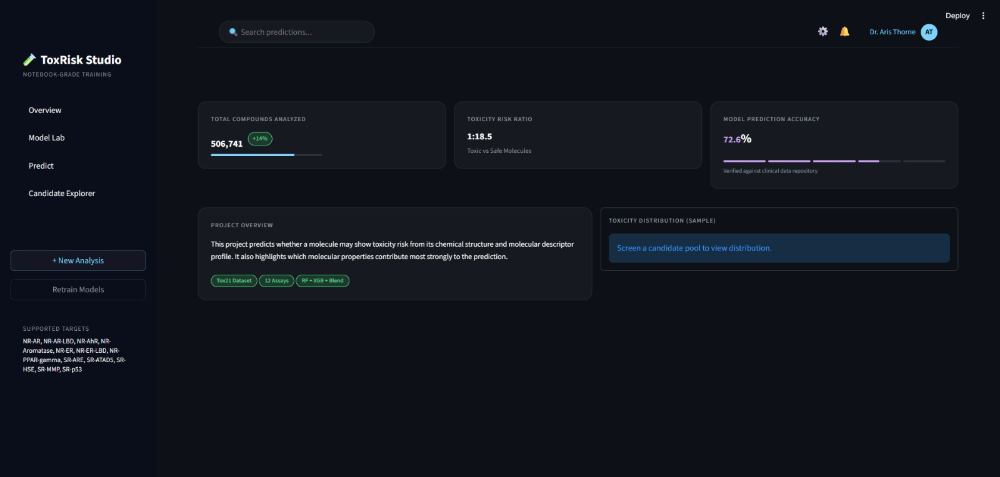
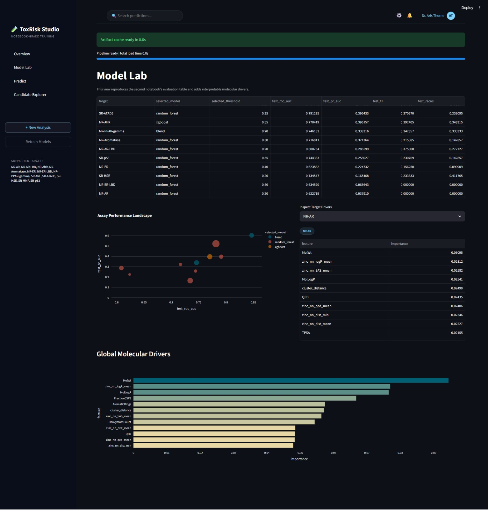
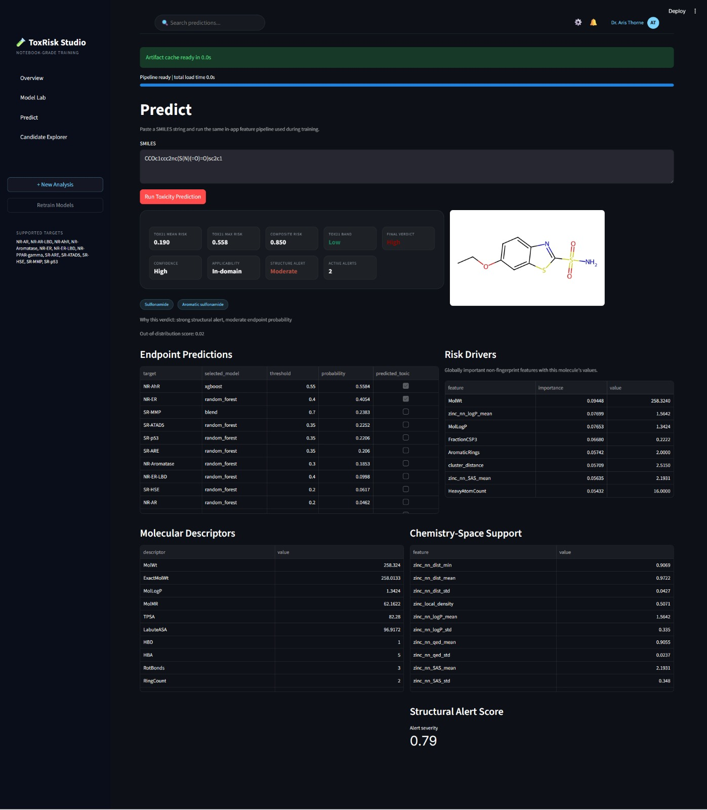
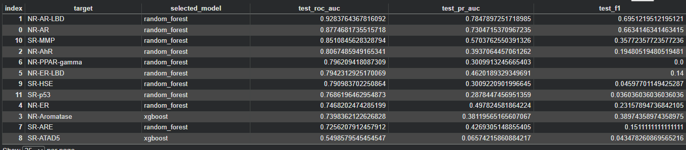
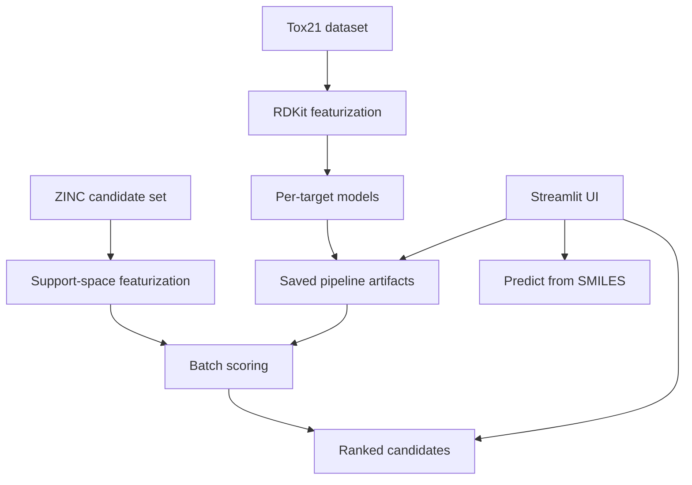

# ToxRisk Studio: Drug Toxicity Prediction & Screening

ToxRisk Studio is an end-to-end toxicity risk scoring system that:

- **learns toxicity endpoint risk** from the **Tox21** assay dataset (12 endpoints)
- **scores new molecules from SMILES** using a shared RDKit feature pipeline
- **explains model drivers** (which molecular properties push predictions)
- **screens a large candidate pool** (ZINC) to surface **lower-risk, drug-like** molecules
- exposes the full workflow through a **Streamlit** application

## Streamlit Application

The UI is implemented in `streamlit_app/app.py` and is organized as:

- **Overview**
- **Model Lab** (training leaderboard + interpretable drivers)
- **Predict** (score a single SMILES + explanations)
- **Candidate Explorer** (screening / browsing ZINC candidates)

**Overview / Dashboard (UI screenshot)**



**Model Lab (UI screenshot)**



**Predict (UI screenshot)**



**Candidate Explorer (UI screenshot)**


**Additional screenshots**




## Conceptual Architecture

The system has three layers:

- **Feature layer (chemistry)**: SMILES parsing + RDKit descriptors + Morgan fingerprints
- **Model layer (toxicity pipeline)**: per-target classifiers + thresholding + aggregation
- **Application layer (Streamlit)**: training/loading pipeline + visualizations + screening workflows



## Modeling Approach (What is actually implemented)

- **Targets**: 12 Tox21 endpoints (listed in `src/config.py` as `TARGETS`)
- **Models per endpoint**:
  - `RandomForestClassifier`
  - `XGBClassifier` (if installed)
  - an optional **blend** (weighted probability combination)
- **Split discipline**: cluster-aware split over chemical descriptor space (KMeans-based)
- **Selection**: choose the best candidate by validation metrics, then pick a per-target probability threshold

The trained pipeline is serialized to `artifacts/toxicity_pipeline.joblib`.

## Risk Scoring (How predictions are turned into a verdict)

The app produces multiple signals and bands:

- **Tox21 mean risk**: mean probability across the 12 endpoints
- **Tox21 max risk**: maximum endpoint probability
- **Structural alert score**: rule-based toxicophore alerts (SMARTS patterns)
- **OOD/App Domain**: distance-from-support metrics and applicability banding
- **Composite risk**: a combined signal used to assign the final risk band

The current decision logic is described in `TOXICITY_FLAGGING_GUIDE.md`.

## Running the Project

### 1) Install dependencies

```bash
pip install -r requirements.txt
```

**Note**: `rdkit` can require a conda-based install depending on your environment.

### 2) Ensure datasets exist

The app expects the following files under `data/`:

- `data/tox21.csv`
- `data/250k_rndm_zinc_drugs_clean_3.csv`

### 3) Run the Streamlit app

```bash
streamlit run streamlit_app/app.py
```

On first run, the app will load a saved pipeline from `artifacts/` (if present) or train a new one.

## Repository Walkthrough (Files & Folders)

This section describes what each major file/folder in the repository is used for.

### Root

- **`.gitattributes`**
  - Git attributes configuration for the repository.
- **`.gitignore`**
  - Git ignore rules (keeps local/derived files out of version control).
- **`README.md`**
  - Project concept, architecture, and directory walkthrough.
- **`requirements.txt`**
  - Python dependencies for training + inference + Streamlit UI.
- **`colab_preview_fix.txt`**
  - Notes used to make notebook previews/rendering behave consistently in hosted notebook environments.
- **`SYSTEM_BLUEPRINT.md`**
  - High-level system architecture and intended data flow.
- **`IMPLEMENTATION_DETAILS.md`**
  - Concrete modeling choices: per-target training, KMeans split strategy, metrics.
- **`PROJECT_RULES.md`**
  - Project conventions and repository operating rules.
- **`PROJECT_PLAN.md`**
  - Milestone-oriented plan used during development.
- **`IMPROVEMENT_STRATEGY.md`**
  - Ideas and experiments for improving performance and robustness.
- **`TOXICITY_FLAGGING_GUIDE.md`**
  - How the app assigns toxicity risk bands and what is currently flagged.
- **`EXTERNAL_TOXIC_DRUG_ANALYSIS.md`**
  - Summary of behavior on an external toxic drug set and how it motivates alerts/OOD logic.
- **`dashboard.jpeg`**, **`modellab.jpeg`**, **`predict.jpeg`**, **`candidate explorer.jpeg`**
  - Streamlit UI screenshots used in this README.
- **`image.png`**, **`image copy.png`**
  - Additional UI screenshots used in this README.

### `artifacts/`

Stores trained assets and outputs.

- **`toxicity_pipeline.joblib`**
  - Serialized `ToxicityPipeline` used by the app.
- **`metadata.json`**
  - Training metadata and feature schema details.
- **`models_improved/`**
  - Saved per-target models and intermediate artifacts.
- **`tox21_zinc_improved_results.csv`**
  - Example evaluation table output.

### `data/`

- **`tox21.csv`**
  - Supervised training dataset containing `smiles` + 12 endpoint labels.
- **`250k_rndm_zinc_drugs_clean_3.csv`**
  - Candidate screening dataset containing `smiles` + `logP`, `qed`, `SAS`.
- **`toxic_drugs_for_testing.csv`**
  - External evaluation set used as a stress test (not a replacement for Tox21 labels).
- **`CodeCure Biohackathon Problem Statement (1).pdf`**
  - The original problem statement included with the dataset.

### `src/` (Core library)

- **`src/config.py`**
  - Central configuration: dataset paths, target list, feature sizes, training defaults.
- **`src/chemistry.py`**
  - RDKit featurization:
    - SMILES parsing (`mol_from_smiles`)
    - descriptors (`calc_descriptor_dict`)
    - Morgan fingerprints
    - structural alert detection (SMARTS patterns)
    - support-space features derived from ZINC (nearest-neighbor + clustering signals)
- **`src/modeling.py`**
  - Training + inference pipeline:
    - per-target model training and selection
    - threshold selection and evaluation metrics
    - pipeline persistence/loading (`get_or_train_pipeline`)
    - scoring logic used by the Streamlit app and scripts
- **`src/__init__.py`**
  - Package marker.

### `streamlit_app/`

- **`streamlit_app/app.py`**
  - The Streamlit application:
    - loads / trains the pipeline
    - renders pages (Overview / Model Lab / Predict / Candidate Explorer)
    - displays performance tables, risk drivers, and screening results

### `notebooks/`

- **`01_tox21_training_colab.ipynb`**
  - Baseline training workflow in notebook form.
- **`02_tox21_zinc_improved_training_colab.ipynb`**
  - Improved workflow including the ZINC support-space features.

### `scripts/`

- **`scripts/evaluate_external_dataset.py`**
  - CLI evaluation for an external dataset with a `smiles` column.
  - Produces a scored CSV and a markdown report under `artifacts/external_eval/`.

  ```bash
  python scripts/evaluate_external_dataset.py data/toxic_drugs_for_testing.csv
  ```

## Notes

- The `artifacts/toxicity_pipeline.joblib` file can be large because it contains the full trained pipeline.
