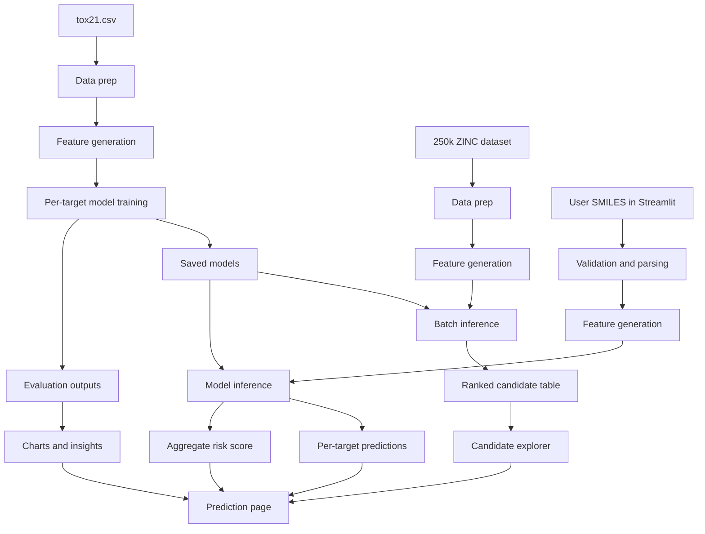

# System Blueprint

## Overview

The project will have three main layers:

1. training pipeline
2. screening pipeline
3. Streamlit application

## High-Level Architecture



## Training Pipeline

### Inputs

- `tox21.csv`

### Outputs

- trained model files
- feature schema
- metrics tables
- plots

### Steps

1. load dataset
2. validate required columns
3. parse SMILES
4. generate descriptors and fingerprints
5. split per target
6. train per-target models
7. evaluate and save results

## Screening Pipeline

### Inputs

- `250k_rndm_zinc_drugs_clean_3.csv`
- trained models

### Outputs

- predicted probabilities for all targets
- aggregate ranking score
- top candidate shortlist

### Steps

1. load ZINC dataset
2. clean SMILES strings
3. generate same features as training
4. run all target models
5. aggregate predictions
6. join with `qed`, `SAS`, and `logP`
7. save ranked results

## Streamlit App Structure

### Page 1: Home

Purpose:

- explain the problem
- explain how the system works
- show project summary

### Page 2: Predict

Purpose:

- accept user SMILES input
- validate molecule
- run model inference
- return endpoint predictions and aggregate risk

### Page 3: Insights

Purpose:

- show model metrics
- show class distributions
- show feature importance plots

### Page 4: Candidate Explorer

Purpose:

- display top screened ZINC molecules
- allow filtering by score, `qed`, `SAS`, `logP`

## Data Flow Rules

- feature generation code must be shared
- model loading must be centralized
- ranking logic must be deterministic
- app predictions must use saved models only

## Suggested File Map

```text
src/
  data_prep.py
  features.py
  train.py
  evaluate.py
  predict.py
  screen_zinc.py
  explain.py
  utils.py

models/
  metadata.json
  target_models/

outputs/
  metrics/
  figures/
  screening/

streamlit_app/
  app.py
  pages/
```

## Model Usage Plan

### During training

- generate feature matrix from Tox21
- fit one classifier per target
- save each model with target name

### During app inference

- user enters SMILES
- app parses molecule
- app generates identical feature vector
- app loads all endpoint models
- app predicts endpoint probabilities
- app computes overall risk score

### During batch screening

- load ZINC molecules
- build feature matrix once
- predict using all saved models
- compute ranking score
- save top results for app browsing

## Decision Summary

- frontend: Streamlit
- inference: local/server-side app process
- modeling: per-target binary classifiers
- interpretation: feature importance first, SHAP if time permits
- screening: precomputed batch inference on ZINC
